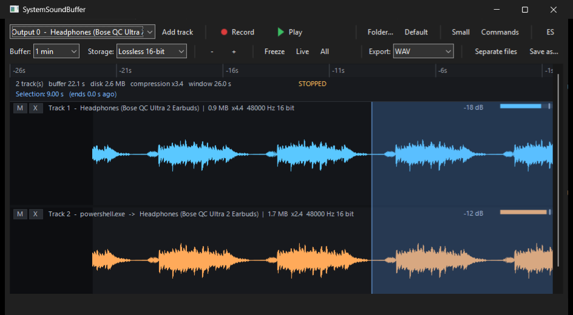

# SystemSoundBuffer

Continuous audio recorder with a ring buffer and trimming.

Records several sources at once, each on its own track: the full system output,
specific applications (WhatsApp, a browser, a game) and input devices. It all
goes into a ring buffer of configurable duration. You pause, select a stretch of
the timeline, save it, and the recording is not interrupted.



Two tracks recording at once, nine seconds of the timeline selected.

- Lossless compression, ring buffer held on disk
- Live waveforms; export any selected range to WAV, MP3 or AAC, aligned across
  tracks

| | Windows | Linux |
|---|---|---|
| Capture: whole output, one application, input device | WASAPI | PulseAudio |
| Playback of the selection | yes | yes |
| MP3 / AAC export | Media Foundation | not implemented, falls back to WAV |
| Interface | yes | yes (GTK3) |

macOS is out of scope: see [`docs/01`](docs/01-viabilidad-y-decisiones.md),
section 6.

## Usage

```
ssbgui                                      # the interface
ssbgui --src output --src app:WhatsApp      # start with tracks set
ssbgui --theme dark --lang es --export mp3  # theme, language, output format
ssbgui --mode cmd                           # command mode (Ctrl+K)
ssbgui --mode small                         # reduced mode (Ctrl+M)

ssb list                                    # the engine, on the command line
ssb rec --secs 20 --buffer 300 --src output --src app:WhatsApp --src input
ssb drift --secs 25 --src output --src app:WhatsApp --csv drift.csv
ssb encode grabacion.wav grabacion.mp3 192
ssb selftest
```

## Building

The engine and the command line build on their own. The interface needs the
**NAppGUI** SDK, built from this fork, which adds Windows dark mode detection and
flat buttons with text:
<https://github.com/Lianeker/nappgui-modernize> (branch `modernize`).

It is expected at `../nappgui`, next to this directory:

```
Prog/
  nappgui/               <- the SDK fork, with its install/
  SystemSoundBuffer/     <- this repository
```

```powershell
. ..\nappgui\tools\env.ps1

# Engine and tests, in any configuration:
cmake -S . -B build -G Ninja -DCMAKE_BUILD_TYPE=Release
cmake --build build
ctest --test-dir build

# The interface, against the installed SDK:
cmake -S . -B build-dbg -G Ninja -DCMAKE_BUILD_TYPE=Debug
cmake --build build-dbg
.\build-dbg\ssbgui.exe
```

If the SDK is missing, CMake skips the interface with a message and builds the
rest. To install it: `cd ..\nappgui` and `.\tools\verify.ps1` (installs Debug).
For Release, `cmake -S nappgui_src -B build-rel -G Ninja
-DCMAKE_BUILD_TYPE=Release -DCMAKE_INSTALL_PREFIX=install` and `cmake --install
build-rel`.

On Linux, `libpulse-dev` is required for the engine and the GTK3 stack for the
interface:

```sh
apt install build-essential cmake ninja-build pkg-config libpulse-dev \
            libgtk-3-dev libcurl4-openssl-dev libglu1-mesa-dev \
            freeglut3-dev mesa-common-dev libwebkit2gtk-4.1-dev \
            pulseaudio pulseaudio-utils xvfb

cmake -S . -B build-linux -G Ninja -DCMAKE_BUILD_TYPE=Release \
      -DSSB_NAPPGUI_DIR=../nappgui/install-linux/cmake
cmake --build build-linux
ctest --test-dir build-linux

sh probes/linux-tono.sh 10          # virtual sink + known tone: proves capture records it
sh probes/linux-interfaz.sh         # the whole GUI cycle under Xvfb, verifying the export
sh probes/linux-captura.sh 25       # records the sink monitor and one application
sh probes/linux-reproduccion.sh     # plays a saved range and listens to the result
sh probes/linux-arranque.sh 25      # starts and closes the interface, counting crashes
```

Builds with `/W4 /WX` on MSVC and `-Wall -Wextra -Werror` on gcc.

## Standalone executable

A Release build of `ssbgui.exe` needs no Visual C++ redistributable and no DLL
beyond those Windows ships. It is ~600 KB. Prebuilt binaries are on the
[releases page](../../releases).

```
> dumpbin /DEPENDENTS ssbgui.exe
  dwmapi ole32 MMDevAPI AVRT MF MFPlat MFReadWrite COMCTL32 UxTheme
  WS2_32 gdiplus SHLWAPI KERNEL32 USER32 GDI32 SHELL32 COMDLG32 ADVAPI32
```

This works because the SDK builds with the static CRT (`/MT`) and links the
static WebView2 loader.

The ring buffer is created in `ssb-gui-buffer`, relative to the working
directory the executable is launched from. Run it from a directory of its own.

## Layout

```
SystemSoundBuffer/
  ssb_core/    engine: sources, ring buffers, compression, peak map, saving. C, no GUI.
    win/       WASAPI capture, playback, MP3/AAC encoding
    linux/     PulseAudio capture and playback
                 (macOS out of scope: see docs/01, section 6)
  ssb_gui/     interface with NAppGUI, consumer of ssb_core
    ssbapp.c   window, controls, life cycle
    ssbwave.c  the waveform canvas: drawing, selection, zoom
  probes/      test programs used to produce the measurements in docs/
  docs/        design notes
```

## Design notes

One document per round of work: what was changed, why, and the measurements it
was based on. Written in Spanish.

| | |
|---|---|
| [01](docs/01-viabilidad-y-decisiones.md) | Capture APIs per platform; the nine architecture decisions |
| [02](docs/02-motor.md) | Engine structure, compression ratios, ring buffer |
| [03](docs/03-sincronizacion.md) | Timeline placement: wall clock vs frame count |
| [04](docs/04-interfaz.md) | Interface, and how it is tested by automation |
| [05](docs/05-ajustes.md) | Capture dropouts, waveform stability, window theme |
| [06](docs/06-exportacion.md) | MP3 and AAC via the system encoder; language; track muting |
| [07](docs/07-buffer-y-pistas.md) | Buffer resizing while recording; per-track controls |
| [08](docs/08-corrupcion-y-vista.md) | Track folder reuse; ring discard bounds; the ruler |
| [09](docs/09-modos.md) | Reduced mode and command mode |
| [10](docs/10-el-dialogo-que-movia-el-suelo.md) | The Win32 file dialog changes the working directory |
| [11](docs/11-chasquidos-y-ajustes.md) | Source of the audio artefacts; settings persistence |
| [12](docs/12-el-reloj-que-temblaba.md) | Clock jitter vs real gaps; measurement method |
| [13](docs/13-calidad-mezcla-y-escucha.md) | 24-bit storage, mixdown, playback of the selection |
| [14](docs/14-onda-estable-y-que-falta.md) | Waveform bucketing; open gaps |
| [15](docs/15-la-interseccion-y-los-botones.md) | Tracks added mid-recording; per-track buttons |
| [16](docs/16-la-union-y-el-peso-de-un-boton.md) | Selectable span: union vs intersection of tracks |
| [17](docs/17-el-congelamiento-y-la-cabeza-que-saltaba.md) | COM calls on the UI thread; the device watcher |
| [18](docs/18-el-tema-oscuro-que-nunca-existio.md) | Dark mode detection on Windows; keyboard shortcuts |
| [19](docs/19-la-barra-al-estilo-del-explorador.md) | Flat toolbar buttons and separators |
| [20](docs/20-un-microfono-es-mono.md) | Mixing mono and stereo sources |
| [21](docs/21-el-boton-que-decia-recorc.md) | Button widths across languages; artefact detector thresholds |
| [22](docs/22-captura-en-linux.md) | PulseAudio capture on Linux; deriving a per-packet timestamp |
| [23](docs/23-reproduccion-en-linux-y-ci.md) | PulseAudio playback; continuous integration on both platforms |
| [24](docs/24-la-carrera-que-solo-linux-enseno.md) | A startup race in the portable engine, exposed by a faster backend |
| [25](docs/25-el-limite-izquierdo-del-buffer.md) | Enlarging the ring buffer while recording did not enlarge its index |
| [26](docs/26-el-destello-y-el-congelon.md) | Startup flash; export moved to a worker thread, and why the freeze remains |
| [27](docs/27-lo-escrito-y-lo-que-ocupa.md) | The disk figure counted every block ever written, not what the ring holds |
| [28](docs/28-linux-deja-de-ser-una-promesa.md) | A virtual sound server in CI: Linux capture and the GTK cycle, proven rather than claimed |

## Dependencies

None external. The GUI uses the NAppGUI SDK from `../nappgui`, consumed with
`find_package(nappgui)` from its install prefix. Capture uses only operating
system APIs.